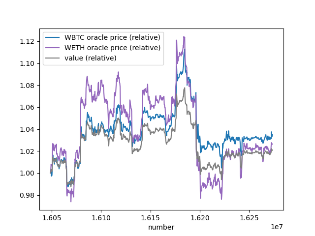
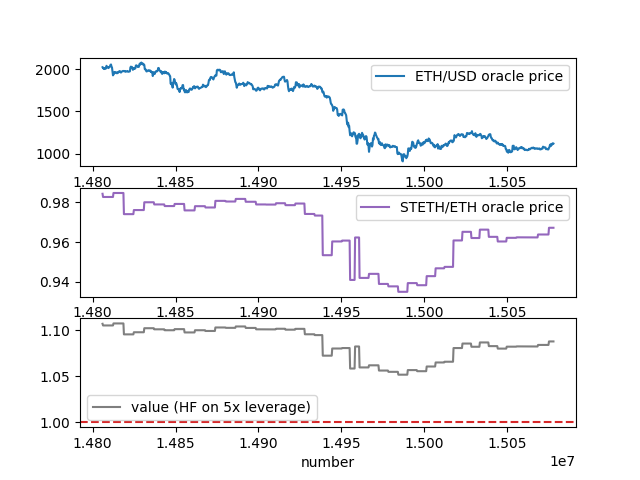

# backtest-ape

Backtesting and forward-testing (via Monte Carlo sims) for DeFi strategies.

## Installation

```sh
hatch build
hatch shell
(backtest-ape) $ ape plugins install .
```

## Build

```sh
(backtest-ape) $ ape compile --size
```

## Test

```sh
(backtest-ape) $ ape test -s
```

## Usage

```sh
(backtest-ape) $ ape run backtester
INFO: Starting 'anvil' process.
You are connected to provider network ethereum:mainnet-fork:foundry.
Runner type (BaseRunner, BaseCurveV2Runner, BaseUniswapV3Runner, CurveV2LPRunner, UniswapV3LPRunner): CurveV2LPRunner
Runner kwarg (ref_addrs): {"pool": "0xD51a44d3FaE010294C616388b506AcdA1bfAAE46"}
Runner kwarg (num_coins): 3
Runner kwarg (amounts): [1000000000000, 5946382600, 820567784927637667840]
Deploying mock ERC20 tokens ...
Start block number: 16219691
Stop block number [-1]:
Step size [1]:
Initializing state of mocks from block number 16219691 ...
Iterating from block number 16219692 to 16270201 with step size 1 ...
Processing block 16219692 ...
State of refs at block 16219692: {'balances': [49753542730360, 299470579545, 42256392553951116624718], 'D': 149811847101739918524603074, 'A_gamma': [183752478137306770270222288013175834186240000, 581076037942835227425498917514114728328226821, 1633548703, 0], 'prices': [16693207875853529503168, 1185215639716509143580], 'total_supply': 179765246450053705933358}
Backtester value at block 16219692: 2981325191662
```

## Results

[Curve Tricrypto2 LP position](scripts/results/CurveV2LPRunner_16048833_-1_300.csv)
from block 16048833 to 16273534:



[Gearbox V2 stETH strategy (5x leverage)](scripts/results/GearboxV2STETHRunner_backtest_14805946_15078047_300.csv)
from block 14805946 to 15078047:



